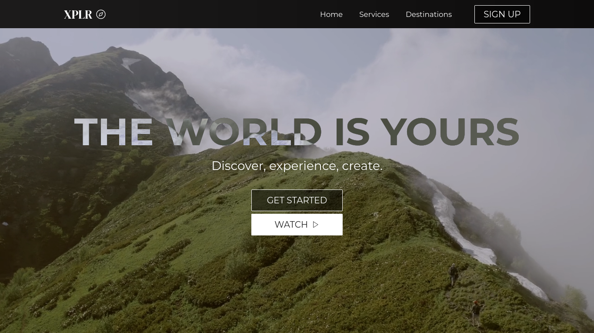

# XPLR

<!--  -->

> A travel company for strong-hearted adventurers.

## 💻 Project

A simple ReactJS exercise.
🔗 [See it live](https://trvl-dot.vercel.app)

## 🏅 Acknowledgements

Based on [Brian Design's Tutorial](https://www.youtube.com/watch?v=I2UBjN5ER4s). Thank you!

## ⚙ Tech

 
 
 
 
 

### TODO:
- FIX the mobile home view.
- ADD the carossel in the services tab.
<!-- - FIX the mobile navbar menu. -->
- CHANGE the buttons to something nicer.
- ADD a footer.
- FIX navbar typo "onClck"